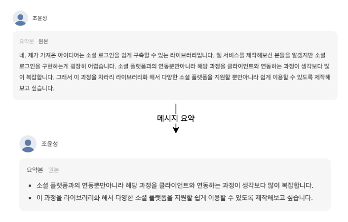
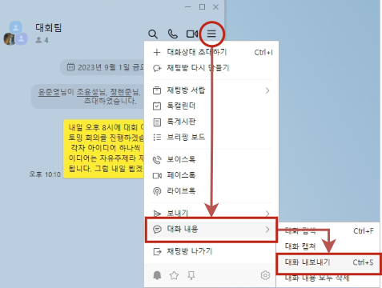
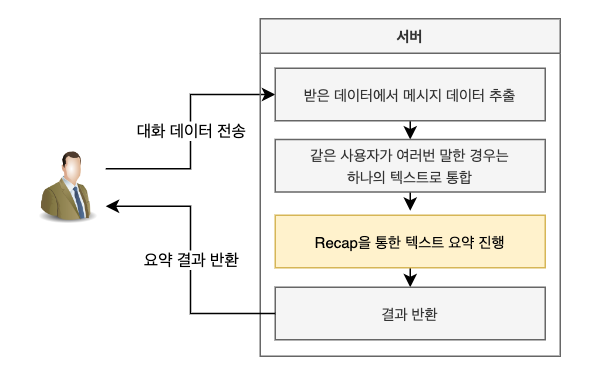

# Recap Examples - 카카오톡 회의록 요약



[사이트 이동](https://recap-examples.junyoung.dev/)

본 프로젝트는 [Recap](https://github.com/team-recap/recap) 라이브러리를 통해 카카오톡에서 진행한 회의를 자동으로 요약해주는 예제입니다.

카카오톡의 `대화 내보내기` 기능을 통해 얻은 대화 내용을 사이트 내에 입력하면 자동으로 회의 내용을 요약하여 보여줍니다.


## 이용 방법
### 1. 대화 데이터 추출
<br>
카카오톡 채팅방 내의 우측 상단 `더보기 버튼` > `대화 내용` > `대화 내보내기` 클릭 후 txt 파일 저장

### 2. 데이터 입력
저장한 txt 파일을 열어 전체 내용을 사이트 내 입력창에 입력

### 3. 요약 시작
사이트 하단의 `요약하기` 클릭


## 기술 스택
### Frontend

### Backend


## 프로젝트 구조


본 웹 서비스의 전반적인 클라이언트와 서버 간 통신은 웹 소켓을 통해 이루어집니다. 이때 소켓통신을 진행하는 이유는 대화를 요약한 결과 반환이 메시지의 길이에 따라 지연될 수 있기 때문입니다. 그러면 차례대로 데이터 플로우를 살펴보겠습니다.
### 1. 먼저, 소켓 통신을 통해 클라이언트가 서버로 대화 데이터를 전송합니다.
텍스트 형태로 이루어진 데이터를 클라이언트가 서버로 전달합니다.
### 2. 서버에서는 받은 데이터에서 메시지 데이터만 추출한 뒤 사용자별로 메시지를 정리합니다.
받은 데이터에서 대화방 이름, 참여자 이름 리스트는 필요 없기 때문에 이를 나타내는 데이터 row를 삭제하여 메시지를 저장합니다. 그리고 메시지에서 한 사람이 연속적으로 여러번 말한 경우 처음 메시지에 다른 메시지들을 이어붙입니다. 이때 만약 같은 사람이 작성한 두 메시지의 전송 날짜가 다른 경우는 해당 작업을 수행하지 않습니다.
### 3. Recap을 통해 텍스트 요약을 진행한 뒤 결과를 반환합니다.
Recap을 통해 각 메시지 별로 요약을 진행합니다. 요약을 완료하면 기존 메시지와 요약된 메시지를 같이 클라이언트로 전송합니다.


## 샘플 입력 데이터
아래 샘플을 그대로 복사해 사이트에 붙여넣기 하면 쉽게 결과를 확인할 수 있습니다.
```
대회팀 님과 카카오톡 대화
저장한 날짜 : 2023-09-03 18:57:20

--------------- 2023년 9월 1일 금요일 ---------------
윤준영님이 조윤성님, 정현준님, 김주완님을 초대하였습니다.
[윤준영] [오후 10:10] 내일 오후 8시에 대회 아이디어 브레인스토밍 회의를 진행하겠습니다. 대회를 위한 각자 아이디어 하나씩 가져와 주세요. 아이디어는 자유주제라 재량껏 가져오시면 됩니다. 그럼 내일 뵙겠습니다!
--------------- 2023년 9월 2일 토요일 ---------------
[윤준영] [오후 8:16] 아이디어 회의 시작하겠습니다! 한명씩 돌아가면서 아이디어 발표하고 Q&A 시간 갖는걸로 하겠습니다. 먼저, 주완님부터 시작해주시면 됩니다.
[김주완] [오후 8:16] 일단 제가 생각한 아이디어는 헬스 후 자신의 몸 상태를 3D 아바타로 볼 수 있는 프로젝트입니다. 그리고 아바타를 페이스북 프로필과 같이 친구 혹은 주변 사람들과 공유할 수 있는 기능을 제공할 수 있습니다. 이를 통해 이용자의 동기 부여를 활성화할 수 있는 효과를 얻을 수 있을 것입니다.
[김주완] [오후 8:17] 그리고 제가 봤을 때 다양한 커스터마이징을 지원한다면 좀 더 다채로운 서비스를 제공할 수 있지 않을까 싶네요. 의견 주시면 감사하겠습니다.
[조윤성] [오후 8:17] 그러면 내 몸을 아바타화하기 위해 이용자가 직접 자신의 키나 몸무게 뿐만아니라 피부색이나 화장까지 커스터마이징을 진행할 수 있도록 개발해야 하나요?
[김주완] [오후 8:18] 일단 생각해 본 아바타 생성 과정은 일단 말씀하신대로 입니다. 하지만 본인의 사진을 찍은 후 이를 서비스 내에서 분석해서 아바타를 생성해 주는 것도 괜찮을 것 같아요.
[정현준] [오후 8:19] 그렇다면 아무래도 사람의 체형은 다양하니까 이를 폭넓게 탐지할 수 있는 인공지능 모델을 구해야겠네요.
[김주완] [오후 8:19] 네 맞습니다. 일단 초기에는 사용자가 직접 아바타를 커스터마이징 하도록 하고요. 만약에 고도화가 진행된다면 인공지능 모델을 구현해서 아바타를 이용자가 쉽게 생성할 수 있도록 하면 좋을 것 같아요.
[윤준영] [오후 8:19] 좋습니다. 다른 질문 없으신가요?
[윤준영] [오후 8:19] 질문 없으시면 현준님 발표 시작해주세요.
[정현준] [오후 8:19] 제가 가져온 아이디어는 미래 교통 상황 예측 서비스입니다. 이 서비스는 사용자가 내일 몇시 쯤 출발한다고 설정하면 도착지까지 미래 교통 상황을 예상해 시간이 얼마나 걸리는지 예측합니다. 그렇게 되면 사용자는 내일 몇시 쯤 출발하는게 적당한지 알 수 있어 교통량이 적은 시간대에 이동할 수 있을 것입니다. 또한 이러한 라이브러리를 제작해 네이버 지도와 카카오맵과 같은 서비스에 쉽게 적용되어 사용자가 빠르게 기능을 사용해 볼 수 있을 것이라 생각합니다.
[김주완] [오후 8:20] 오 굉장히 좋은 아이디어네요. 저도 가끔씩 차량을 이용해 이동하는데 이러한 서비스가 있다면 내가 출발시간을 조절해서 스트레스 받지 않고 운전할 수 있어서 좋을 것 같아요. 그런데 교통량 예측은 어떻게 진행하나요?
[정현준] [오후 8:20] 이거에 관련된 자료들을 좀 찾아봤긴 했습니다. 찾아보니까 대부분 RNN이라는 시계열 예측 인공지능 모델을 사용해서 예측하더라구요. 그래서 저희도 구현을 위해 해당 모델을 구현해서 예측을 진행할 수 있을 것 같습니다.
[윤준영] [오후 8:20] 오 굉장히 좋은 아이디어네요. 다만 아이디어 구현을 위해서는 웹 프로젝트로 진행해야 하는거죠?
[정현준] [오후 8:20] 네 맞습니다. 웹 기반으로 만들면 모바일뿐만 아니라 PC 이용자들도 사용할 수 있으니까 좋을 것 같아요. 그런데 굳이 웹이 아니더라도 처음에는 그냥 간단하게 몇시 몇분에는 소요시간이 어떻게 된다고 보여줘도 괜찮을 것 같습니다.
[윤준영] [오후 8:21] 네 좋습니다. 그러면 마지막으로 윤성님 발표해주세요.
[조윤성] [오후 8:21] 네. 제가 가져온 아이디어는 소셜 로그인을 쉽게 구축할 수 있는 라이브러리입니다. 웹 서비스를 제작해보신 분들을 알겠지만 소셜 로그인을 구현하는게 굉장히 어렵습니다. 소셜 플랫폼과의 연동뿐만아니라 해당 과정을 클라이언트와 연동하는 과정이 생각보다 많이 복잡합니다. 그래서 이 과정을 차라리 라이브러리화 해서 다양한 소셜 플랫폼을 지원할 뿐만아니라 쉽게 이용할 수 있도록 제작해보고 싶습니다.
[김주완] [오후 8:21] 저는 소셜 로그인을 구현하는걸 해본적이 없는데요. 혹시 그러면 프로젝트에 페이스북이랑 네이버 계정 로그인 기능을 만들고 싶다고 하면 각 플랫폼마다 따로 구현해야하나요?
[조윤성] [오후 8:21] 네 맞습니다. 각 소셜 플랫폼마다 다른 API키를 받아서 별도로 구현해야 합니다.
[정현준] [오후 8:21] 오 괜찮네요. 안그래도 이전에 수상작을 살펴보니까 네이버에서 공개 API를 파이썬으로 래핑한 아이디어가 상을 받았더라구요. 그래서 이 아이디어도 조금 더 디벨롭 시키면 좋을 것 같아요.
[윤준영] [오후 8:21] 이제 그럼 투표를 진행해보겠습니다. 각자 다른 팀원들 아이디어 중 맘에드는 하나 알려주세요.
[조윤성] [오후 8:22] 저는 주완님 아이디어 교통 상황 예측 추천합니다.
[김주완] [오후 8:22] 저는 현준님 아이디어 추천합니다!
[정현준] [오후 8:22] 저는 윤성님 아이디어가 좋은 것 같아요.
[윤준영] [오후 8:22] 음. 그럼 투표수가 1:1:1 이군요. 그렇다면 저는 윤성님 아이디어로 하겠습니다.
[윤준영] [오후 8:22] 그러면 윤성님 아이디어 2, 나머지 분들 1로 저희 팀 아이디어는 윤성님의 소셜 로그인 라이브러리로 정하겠습니다.
[조윤성] [오후 8:22] 감사합니다~
[윤준영] [오후 8:22] 그러면 내일 오후 8시에 다시 만나서 나머지 내용 회의 진행하도록 하겠습니다. 내일 회의 전까지 각자 윤성님 아이디어 디벨롭할만 것들 가져와 주세요. 그럼 내일 뵙겠습니다. 수고하셨습니다~
[정현준] [오후 8:22] 수고하셨습니다~
[김주완] [오후 8:22] 다들 수고하셨습니다.
[조윤성] [오후 8:22] 수고하셨습니다!
```
